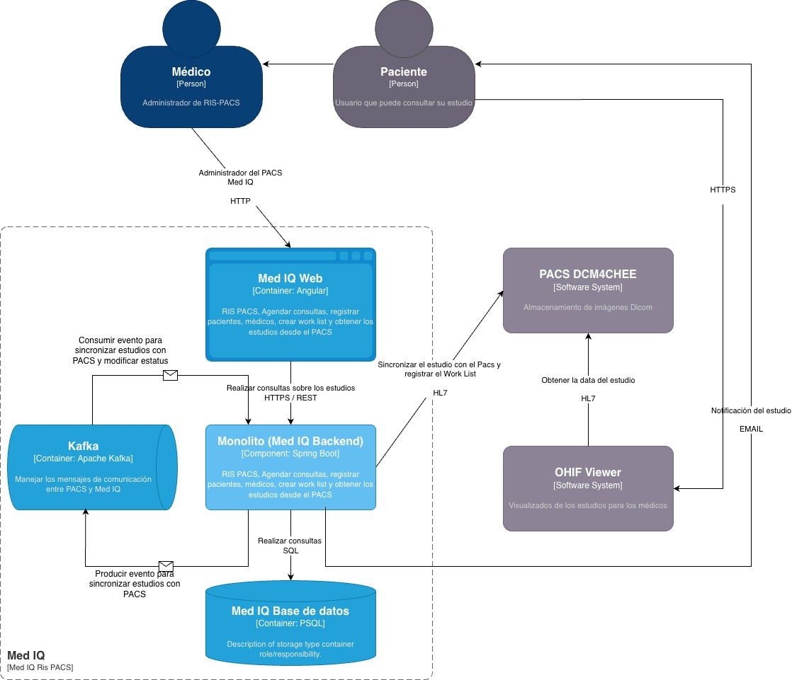

### Bloques de Construcción

### 5.1 Vista de Contenedores (C4 Level 2)

- [Regresar al indice](../index.md)

### 5.2 Componente: Med IQ Web (Angular)

**Responsabilidad:**

- Interfaz de usuario para médicos y pacientes
- Gestión de citas, pacientes, worklist
- Navegación a visualizador OHIF

**Tecnología:**

- Angular 17
- Angular Material (UI components)

**Seguridad:**

- JWT tokens (almacenados en httpOnly cookies)
- Route guards (solo médicos ven worklist)
- HTTPS obligatorio

### 5.3 Componente: Med IQ Backend (Spring Boot)

**Responsabilidad:**

- API REST para frontend
- Lógica de negocio (RIS)
- Integración con PACS vía HL7/Kafka
- Autenticación y autorización

**Tecnología:**

- Java 17
- Spring Boot 3.2
- Spring Security (JWT)
- Spring Data JPA
- Kafka Client

**Arquitectura por Capas:**
Explicaición
